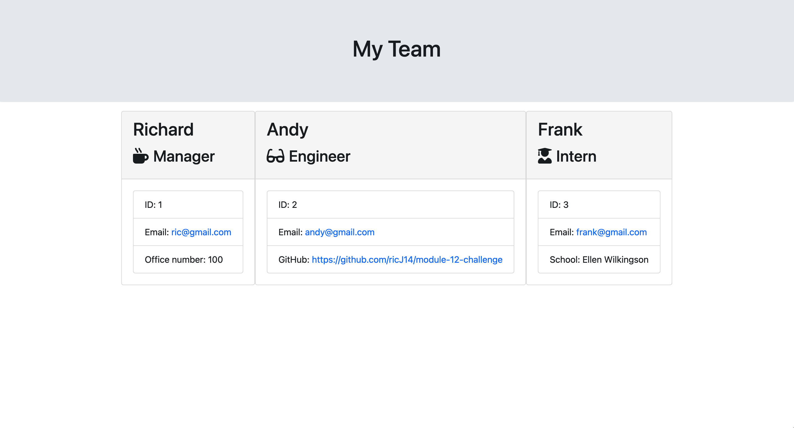

# module-12-challenge
Team profile generator

## Description

The task was to take the starter code and convert it into a working Node.js command-line application. This application will take in information about employees on a software engineering team, then generate an HTML webpage that displays summaries for each person.

## Process

First I needed to add the relevant dependencies (inquier and Jest), then I created the relevent js files for the lib folder. These files consisted of the object models. I then completed the Code used to gather information about the development team members, and render it to the HTML file.

